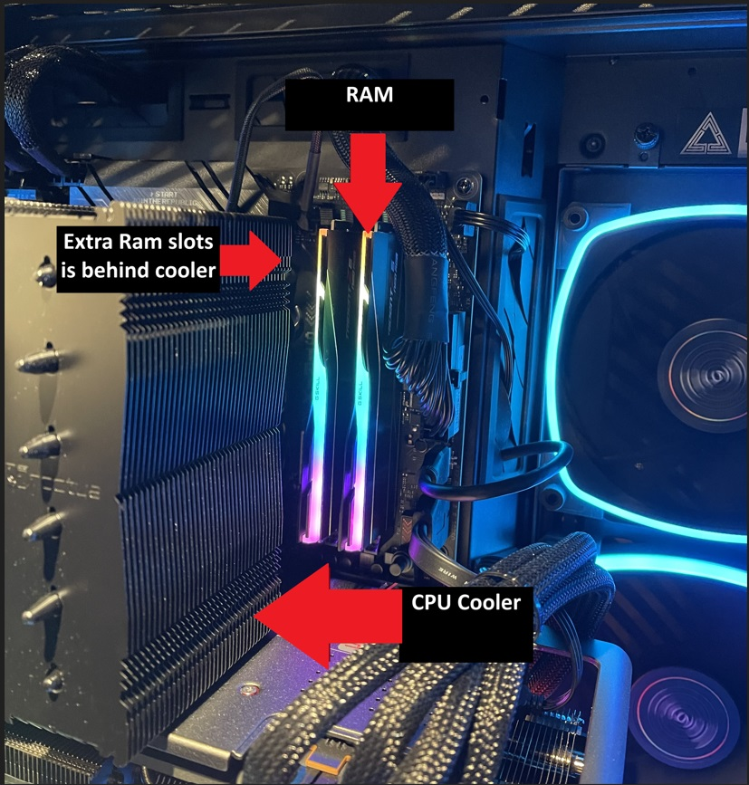

# UX-Journal-atorrespena-1
# Custom PC Building with PCPARTPICKER
#### Hello world I used [PCPARTPICKER](https://pcpartpicker.com/) to customize my own build a while back. I set out on a mission to assemble my personal computer ([PC](https://en.wikipedia.org/wiki/Personal_computer)) without getting lost or drowning in a sea of compatibility issues. I was searching through forums and browsing different guides to avoid any compatibility issues until I came across pcpartpicker. This website made it way easier to choose computer hardware([PC components](https://en.wikipedia.org/wiki/Computer_hardware)) for my build without running into compatibility issues. 

#### With the guidance of PCPARTPICKER intuitive interface, which demonstrates an application of **`"Error Prevention"`**, a [usability guideline for using concepts in the real world](https://www.nngroup.com/articles/ten-usability-heuristics/) helps prevent any compatibility issues by providing real time compatibility checks, ensuring that each chosen part works well together. 

https://github.com/ChicoState/ux-personal-portfolio-atorrespena/assets/142855422/e1ff25b2-4290-433f-a92f-8151cd42da39

#### While PCPartPicker excels in providing an effective and satisfying user experience, it lacks on educational resources or tutorials to enhance its learnability for first time users. Additionally, as demonstrated in the video above, there's a disclaimer indicating that the tool doesn't verify physical constraints. This poses a significant drawback, particularly for novice users, as neglecting to verify the correct measurements for their PC components could lead to potential issues.

#### To address these issues, PCPartPicker could enhance user experience by incorporating interactive tutorials or walkthroughs. These guides would assist users in comprehending the purpose and functionality of each component selection more effectively. Another way to solve this issue is to add a 3D interactive model showcasing all selected components. This feature would not only ensure that there are no physical constraints but also align with users’ **`mental model`** of the PC building process which helps ensure users feel confident in their decision making.

#### Using this website was a game-changer in building my PC. It made the process so much faster and simpler, allowing me to pick compatible parts effortlessly, all thanks to its efficient and user-friendly interface. However, I stumbled upon a major issue. Just check out the picture that I provided above – the [CPU cooler](https://gadgetmates.com/what-is-a-cpu-cooler) is hogging the extra two [RAM](https://www.crucial.com/articles/about-memory/support-what-does-computer-memory-do) slots, and let me tell you, it's beyond infuriating. I had plans for those slots, and now they're just sitting there... mocking me. But hey, who am I kidding? With 32[GB](https://www.makeuseof.com/tag/memory-sizes-gigabytes-terabytes-petabytes/) already onboard, I probably didn't need them anyway... I hope. While the website's interface was a lifesaver, I still needed to do some extra digging to avoid any hiccups like this one. Thankfully, my experience wasn't a total trainwreck, but for other people who are just dipping their toes into PC building, it could spell trouble. Take it from me, even with all the bells and whistles, it's worth doing your homework on PC parts, especially if you're new to the game. 
