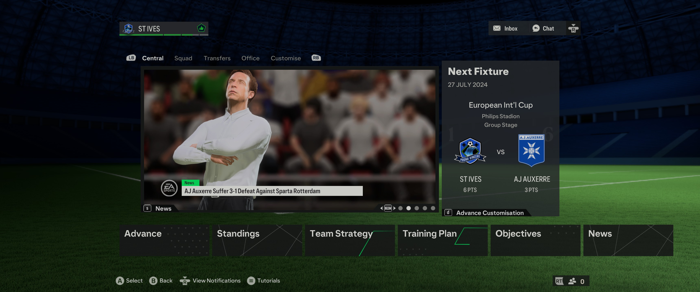
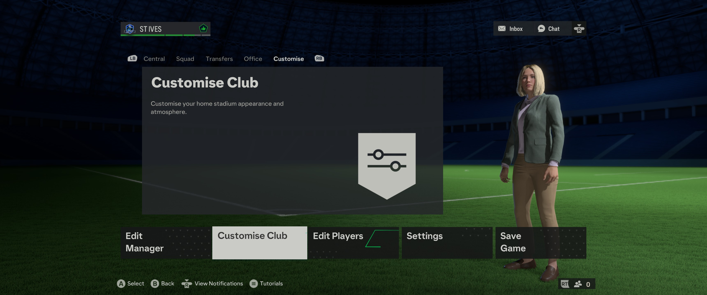

# UX-Journal-atorrespena-2
# The Cluttered Madness?
#### FC24 is a soccer simulation game where you manage players to create the best soccer team possible. You can obtain different real world players and put them together in a team. Additionally, you can upgrade individual players to improve their stats like physicality, pace, and passing ability. There's different game modes to play in such as player career mode, management mode, and ultimate team mode. 
This is a game that I play regulary and most recently on management mode. My goal is to make the best team that I could. I do this by improving each players stats so that they could play more effectively and to make better formations so they can link up with each other better. 
In my opinion FC24's interface demonstrates some lack of **"flexibility and efficiency of use"**, a usability guideline that helps interfaces be easily explored by making shortcuts or other methods that makes things flow faster. The interface feels cluttered since it has many tabs and other things going on, shown below. 

This makes it hard to navigate through the game since you have to go through main tabs to get to other tabs within those tabs. Even talking about can be confusing.  

Since there's many things to go through it makes it less efficient to navigate the game, especially when you need to save the game. This is found on the very last tab which is very inefficient and could have been done better by being tied to a button on the controller for easier access or even a different page on the game screen.

Even though it's a cluttered mess, some aspects are easy to use. I like how
